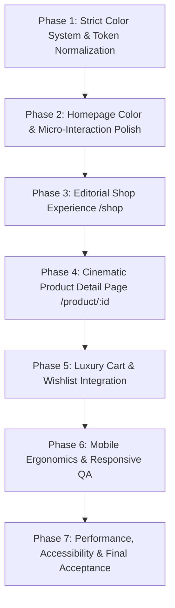

# Drishti Atelier — HEAVN-Inspired Luxury Experience
## Architectural Analysis & Implementation Plan (Strict Color System: Black, White, Gray & #F97D01)

> **Reference Paradigm:** [HEAVN One](https://heavn-one.webflow.io/)  
> **Brand Identity:** Drishti Atelier (Architectural & High-End Eyewear)  
> **Color Constraint:** **ONLY Black, White, Gray, and #F97D01** (No neon yellow, no blue, no green, no purple)  
> **Core Aesthetic:** Apple Product Launch + Haute Eyewear Campaign + Continuous Scroll Storytelling + Ultra-Refined E-Commerce

---

## 1. Executive Summary & Specification Analysis

The task is to transform the Drishti Glasses e-commerce platform from a standard retail store into a **cinematic, editorial, product-first luxury experience** modeled on the high-end spatial storytelling of **HEAVN One**.

### 1.1 Core Tenets from the Prompt Document
1. **Continuous Narrative (Not Disjointed Grids):**
   - Shift from standard e-commerce flow (`Hero → Grid → Cards → Footer`) to sequential chapter discovery:
     $$\text{Scroll} \longrightarrow \text{Discover} \longrightarrow \text{Understand} \longrightarrow \text{Desire} \longrightarrow \text{Shop}$$
2. **Editorial Restraint & Scale:**
   - Eliminate cluttered cards, excessive borders, heavy shadows, and unnecessary buttons.
   - Utilize clamp-based headline typography (`clamp(3.5rem, 9.5vw, 8.5rem)`), dramatic whitespace, and macro photography where the glasses dominate the screen.
3. **Heroic Product Visualization:**
   - Full-bleed product renders, caustics, multi-angle perspective switching (Front, 45°, Side Temple, Worn-on-face), and 5-chapter engineering breakdowns (Titanium Brow, Optical Caustics, Monobloc Hinge, Anatomical Fit, Satin Buffing).
4. **Zero Architecture Disruption:**
   - Preserve existing React 19 + Vite setup, Express APIs, MySQL schemas, cart/wishlist state, and checkout flows intact.
5. **Color System Mandate:**
   - **Exclusively: Black, White, Gray, and #F97D01.** All legacy accent colors (such as `#DFFF00` neon yellow) will be replaced with `#F97D01` (refined luxury amber/orange) and its monochromatic tints.

---

## 2. Color System & Design Token Architecture

The user has mandated a strict color system: **Black, White, Gray, and #F97D01**.

```
+---------------------------------------------------------------------------------+
|                               LUXURY COLOR SYSTEM                               |
|                                                                                 |
|  [ Pure Black ]    [ Obsidian ]      [ Charcoal Gray ]    [ Muted Slate Gray ]  |
|     #000000          #050505             #121212               #666666          |
|                                                                                 |
|  [ Silver Gray ]   [ Studio White ]  [ Pure White ]       [ Luxury Accent ]     |
|     #8E8E8E          #FBFBFB             #FFFFFF               #F97D01          |
+---------------------------------------------------------------------------------+
```

### 2.1 CSS Custom Property Mapping

| Token Name | Hex / RGBA Value | Role / Usage |
| :--- | :--- | :--- |
| `--color-black` | `#000000` | Pure black backgrounds, cinematic stage backdrops, deep shadows |
| `--color-obsidian` | `#050505` | Dark theme surface, hero backdrop, card base |
| `--color-dark-black` | `#070707` | Deep contrast container backings |
| `--color-dark-gray` | `#121212` | Elevated card surfaces, specification boxes, drawer backdrops |
| `--color-titanium-card` | `#161616` | Interactive hover cards, product card background |
| `--color-border-gray` | `#222222` | Ultra-clean 1px structural hairline borders |
| `--color-charcoal-border`| `#1A1A1A` | Secondary divider lines and subtle grids |
| `--color-hairline` | `rgba(255, 255, 255, 0.08)` | Translucent divider lines on dark mode |
| `--color-hairline-dark` | `rgba(0, 0, 0, 0.08)` | Translucent divider lines on light mode |
| `--color-muted-gray` | `#8E8E8E` | Secondary body text, metadata, dimension labels, specs |
| `--color-silver-text` | `#B0B0B0` | High-legibility editorial narrative text |
| `--color-light-gray` | `#EAEAEA` | Light mode card backgrounds, subtle pill tags |
| `--color-studio-white` | `#FBFBFB` | High-key editorial studio white backgrounds |
| `--color-white` | `#FFFFFF` | Primary headlines, contrast text, pure light backgrounds |
| **`--color-accent`** | **`#F97D01`** | **Primary Luxury Accent:** eyebrow dots, active indicators, badges, selection rings |
| **`--color-accent-hover`**| **`#E06F00`** | Hover state for accent buttons and links |
| **`--color-accent-light`**| **`rgba(249, 125, 1, 0.10)`** | Translucent pill backing, subtle glow surfaces |
| **`--color-accent-glow`** | **`rgba(249, 125, 1, 0.28)`** | Specular micro-glows, focus outlines |

---

## 3. Codebase Audit & Component Inventory

### 3.1 Existing Component Landscape
| Component | Location | Current State | Transformation Needed |
| :--- | :--- | :--- | :--- |
| **CinematicGlassesIntro** | `client/src/components/CinematicGlassesIntro` | Complete, metallic light sweep, SVG contours | Update any accent references to `#F97D01`; ensure smooth transition to hero |
| **Navbar** | `client/src/components/Navbar` | Glassmorphic floating nav with mobile drawer | Normalize accent color from neon to `#F97D01`; refine search overlay & cart pill |
| **HeroProductReveal** | `client/src/components/HeroProductReveal` | Macro studio render, caustics, parallax | Fix Oxlint warning; switch accent badge and indicators to `#F97D01` |
| **ProductAnatomy** | `client/src/components/ProductAnatomy` | 5-chapter engineering breakdown | Replace neon progress bars and chapter numbers with `#F97D01` |
| **FullscreenMoments** | `client/src/components/FullscreenMoments` | Pure black advertising spread | Update headline accent span to `#F97D01`; enhance typography |
| **FrameExplorer** | `client/src/components/FrameExplorer` | 4-angle perspective switcher | Switch active tab pills, metrics highlights, and indicators to `#F97D01` |
| **EditorialCollections**| `client/src/components/EditorialCollections` | Curated feature banner & asymmetric grid | Replace neon hover accents with `#F97D01` / White / Gray |
| **ProductCard** | `client/src/components/ProductCard` | Slide-up quick add, wishlist heart, swatches | Switch quick-add hover, wishlist toggle, and stock badges to `#F97D01` |
| **FrameFinder** | `client/src/components/FrameFinder` | Interactive face shape & style advisor | Switch active selection pills and match percentage badge to `#F97D01` |
| **BrandStory** | `client/src/components/BrandStory` | Dual editorial statements & manifesto | Refine typography tracking and button styling |
| **EditorialTestimonials**| `client/src/components/EditorialTestimonials`| Large quotation carousel | Switch active dot indicator to `#F97D01`; star ratings to `#F97D01` |
| **FinalCTA** | `client/src/components/FinalCTA` | Full-bleed headline with radial backdrop | Button hover effects and radial glow aligned to `#F97D01` |
| **Footer** | `client/src/components/Footer` | Minimalist columns, replay intro button | Newsletter input focus, hover states, and brand links aligned |

### 3.2 Pages Needing Implementation Beyond Placeholder
Currently, `/shop`, `/product/:id`, and `/cart` render placeholder components. To fulfill the prompt's vision of an operational luxury e-commerce experience:
- **Editorial Shop Page (`/shop`):** Filter by category (Sunglasses, Optical, Blue Light), face shape, material (Japanese Titanium, Acetate), sorting (Featured, Price, New), and editorial asymmetric grid.
- **Cinematic Product Detail Page (`/product/:id`):** Full-bleed gallery, 360°/angle carousel, technical specification drawer, tactile lens selection, sticky Add-to-Bag bar, and craftsmanship storytelling.

---

## 4. Phase-by-Phase Implementation Roadmap



---

### Phase 1: Strict Color System & Token Normalization
* **Goal:** Eradicate all instances of `#DFFF00`, blue, green, and non-compliant colors. Establish `--color-accent: #F97D01` across all stylesheets and configuration.
* **Actions:**
  1. Modify `client/src/index.css`:
     - Replace `--color-neon-yellow*` with `--color-accent: #F97D01`, `--color-accent-hover: #E06F00`, `--color-accent-light: rgba(249, 125, 1, 0.10)`, `--color-accent-glow: rgba(249, 125, 1, 0.28)`.
     - Update all utility classes (`.btn-editorial:hover`, `.editorial-eyebrow::before`, `.input:focus`, `.badge-neon`).
  2. Update `client/src/App.jsx`:
     - Update Toaster primary success icon from `#DFFF00` to `#F97D01`.
  3. Update all 13 component CSS files:
     - `Navbar.css`: Active link indicator, search button, badge pills, mobile drawer accents.
     - `HeroProductReveal.css`: Eyebrow dot, spec dots, pulse cue.
     - `ProductAnatomy.css`: Active chapter progress bar, chapter numbers, spec badges.
     - `FullscreenMoments.css`: Accent headline span, metadata value highlights.
     - `FrameExplorer.css`: Active pill button border/text, metrics dots.
     - `EditorialCollections.css`: View all hover, tag indicators.
     - `ProductCard.css`: Quick-add button hover, wishlist icon fill, price tag.
     - `FrameFinder.css`: Active filter pills, match card glow, 98% compatibility badge.
     - `BrandStory.css`: Chapter numbers, link underlines.
     - `EditorialTestimonials.css`: Star rating icons, active dot width and color.
     - `FinalCTA.css`: Radial background gradient, button hover glow.
     - `Footer.css`: Newsletter arrow button, social icon hover.
     - `Home.css`: Ambient radial backgrounds shifted from neon-yellow to `#F97D01`.
* **Verification:** Run `grep_search` to verify 0 remaining instances of `#DFFF00` or legacy accent tokens.

---

### Phase 2: Homepage Color & Micro-Interaction Polish
* **Goal:** Ensure the entire continuous scroll narrative (`Hero → Anatomy → Fullscreen Spread → Explorer → Collections → Finder → Story → Testimonials → CTA → Footer`) looks cohesive in Black, White, Gray, and #F97D01.
* **Actions:**
  1. Resolve Oxlint warning in `HeroProductReveal.jsx` (`setMounted(true)` replaced with direct render state or layout effect).
  2. Fine-tune dark-to-light-to-dark scroll transitions between sections so background transitions are velvety and smooth without jarring shifts.
  3. Ensure all hover micro-interactions (arrow translations, image scale from 1.0 to 1.03, subtle border glints) feel understated and expensive.
* **Verification:** Run `npm run lint` and verify 0 warnings and 0 errors.

---

### Phase 3: Editorial Shop Experience (`/shop`)
* **Goal:** Elevate `/shop` from a placeholder into a fully functional, editorial catalog using the authentic database products and photography.
* **Actions:**
  1. Create `client/src/pages/Shop/Shop.jsx` & `Shop.css`.
  2. Include:
     - Editorial header with large typography: `THE ARCHIVE / COLLECTION 2026`.
     - Category filter pills (`All Frames`, `Sunglasses`, `Optical`, `Blue Light`).
     - Sub-filters: Material (`Titanium`, `Acetate`), Shape (`Aviator`, `Wayfarer`, `Round`, `Rectangle`).
     - Sort dropdown (`Featured`, `Price: Low to High`, `Price: High to Low`, `New Arrivals`).
     - Live search query syncing with the navbar search input.
     - Asymmetric product card layout using `ProductCard` with hover alternate images, quick-add, and price display.
* **Verification:** Verify URL query params (`/shop?category=sunglasses`, `/shop?search=titanium`) dynamically filter the catalog.

---

### Phase 4: Cinematic Product Detail Experience (`/product/:id`)
* **Goal:** Implement the HEAVN-style deep product detail page (`/product/:id`).
* **Actions:**
  1. Create `client/src/pages/ProductDetail/ProductDetail.jsx` & `ProductDetail.css`.
  2. Features:
     - Full-width hero product imagery with alternate angle thumbnails (Front, 45°, Temple, On-Model).
     - Sticky right-rail purchase panel: Title, material statement, price, colorway swatches, frame dimension guide, tactile "Add to Bag" button with `#F97D01` accents.
     - Expandable accordion sections: "Architectural Specifications" (Weight: 18.4g, Titanium Grade-5, CR-39 Lenses), "Complimentary Atelier Services" (Free global shipping, 30-day trial, bespoke prescription fitting).
     - Related frames carousel.
* **Verification:** Route to `/product/1`, verify dynamic product loading, angle switching, and Add-to-Bag toast notification.

---

### Phase 5: Luxury Cart & Quick-Bag Drawer
* **Goal:** Seamless shopping experience aligned with the Black/White/Gray/#F97D01 palette.
* **Actions:**
  1. Build an architectural slide-out Quick-Bag drawer accessible from the navbar cart button.
  2. Features: Free shipping progress bar (`Spend $X more for complimentary global courier`), line items with quantity stepper, subtotal, and checkout CTA.
  3. Ensure `/cart` page also offers a full dedicated editorial review.
* **Verification:** Add products to bag from Homepage and Shop; confirm drawer opens smoothly with accurate quantities and subtotal.

---

### Phase 6: Mobile Ergonomics & Responsive QA
* **Goal:** Ensure flawless presentation across mobile viewports without horizontal scrolling or awkward layout breaks.
* **Actions:**
  1. Test and tune responsive breakpoints: 320px, 390px (iPhone 14/15/16), 768px (iPad), 1024px, 1440px.
  2. Ensure all sticky sections stack naturally on mobile touchscreens.
  3. Test fullscreen mobile navigation menu and drawer dismissal with touch and Escape key.
* **Verification:** Verify in mobile viewport emulation with zero horizontal overflow.

---

### Phase 7: Performance, Accessibility & Final Acceptance
* **Goal:** Ensure compliance with all items in the HEAVN acceptance checklist.
* **Actions:**
  1. Verify zero build errors (`npm run build`).
  2. Verify clean linter (`npm run lint` with 0 warnings, 0 errors).
  3. Verify `prefers-reduced-motion` compliance.
  4. Ensure all images have descriptive `alt` tags and lazy-loading enabled for below-the-fold assets.
* **Verification:** Document all changes in the final summary report.

---

## 5. Verification Matrix & Acceptance Criteria

| Criteria | Target | Method |
| :--- | :--- | :--- |
| **Strict Color Adherence** | 100% Black, White, Gray, #F97D01 | Codebase audit for hex codes |
| **Build Stability** | 0 build errors | `npm run build` |
| **Lint Stability** | 0 errors, 0 warnings | `npm run lint` |
| **E-Commerce Routes** | `/`, `/shop`, `/product/:id`, `/cart` all functional | Browser navigation & route checks |
| **Performance** | Responsive GPU transforms, zero scroll-jacking lock | Chrome DevTools frame rate analysis |
| **Mobile Layout** | Clean 320px - 430px rendering, no horizontal scroll | Responsive viewport verification |
