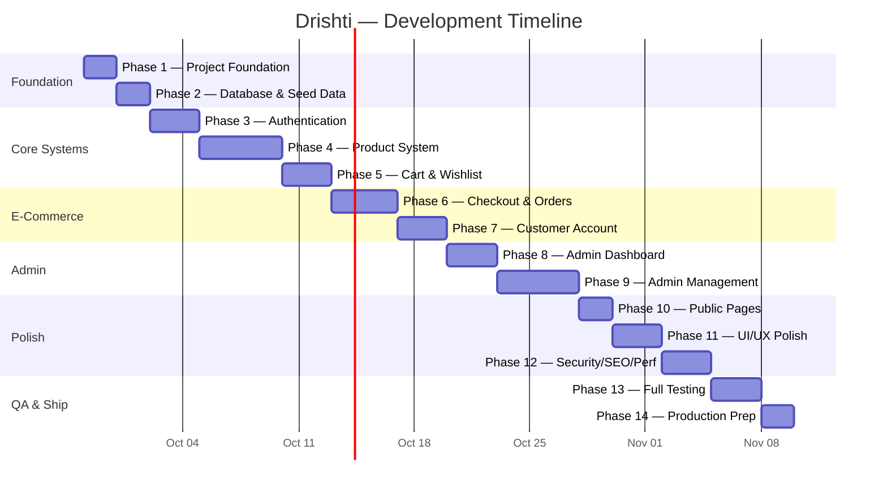

# Drishti — Implementation Plan

> **Generated from**: [DEVELOPMENT_PHASES.md](file:///f:/Drishti_Eye_Care/docs/DEVELOPMENT_PHASES.md) + [BUILD_GUIDE.md](file:///f:/Drishti_Eye_Care/docs/BUILD_GUIDE.md)
> **Date**: September 27, 2026

---

## Project Overview

| Attribute | Details |
|---|---|
| **Project** | Drishti — Full-Stack E-commerce |
| **Business** | Eyewear / Glasses online store |
| **Theme** | Neon Yellow (`#DFFF00`) + Black (`#050505`) |
| **Frontend** | React + Vite + Tailwind CSS |
| **Backend** | Node.js + Express.js (REST API) |
| **Database** | PostgreSQL (Neon) — raw SQL via `pg` |
| **Images** | Cloudinary |
| **Auth** | JWT + bcrypt, role-based (customer/admin) |
| **Total Phases** | 14 |

---

## Phase Analysis & Effort Estimates



---

## Target Project Structure

```text
f:\Drishti_Eye_Care\
│
├── client/                         # React + Vite frontend
│   ├── src/
│   │   ├── assets/                 # Static assets, logo
│   │   ├── components/             # Reusable UI components
│   │   ├── layouts/                # MainLayout, AdminLayout
│   │   ├── pages/                  # Public & customer pages
│   │   ├── admin/                  # Admin pages
│   │   ├── hooks/                  # Custom React hooks
│   │   ├── context/                # Auth, Cart, Wishlist contexts
│   │   ├── services/               # API service layer
│   │   ├── utils/                  # Helpers & formatters
│   │   ├── App.jsx
│   │   └── main.jsx
│   ├── public/
│   ├── package.json
│   ├── tailwind.config.js
│   └── vite.config.js
│
├── server/                         # Node.js + Express backend
│   ├── config/                     # DB config, cloudinary config
│   ├── controllers/                # Route handlers
│   ├── middleware/                  # Auth, admin, validation
│   ├── routes/                     # Express routers
│   ├── services/                   # Business logic
│   ├── utils/                      # Helpers
│   ├── db/                         # DB pool & query helpers
│   ├── uploads/                    # Temp upload dir
│   ├── app.js                      # Express app setup
│   ├── server.js                   # Entry point
│   └── package.json
│
├── database/                       # SQL files
│   ├── schema.sql
│   ├── seed.sql
│   └── migrations/
│
├── docs/                           # Documentation (existing)
├── asstes/                         # Brand assets (existing)
├── .env.example
└── README.md
```

---

## Phase 1 — Project Foundation

> **Goal**: Scaffold both apps, connect DB, establish the design system
> **Effort**: ~2 days

### Tasks

| # | Task | Layer | Details |
|---|---|---|---|
| 1.1 | Initialize React + Vite | Frontend | `npx create-vite@latest ./client` with React template |
| 1.2 | Install frontend deps | Frontend | `react-router-dom`, `axios`, `react-icons`, `react-hot-toast` |
| 1.3 | Configure Tailwind CSS | Frontend | Install & configure with the brand color palette |
| 1.4 | Initialize Express server | Backend | `npm init`, install `express`, `cors`, `dotenv`, `pg`, `bcryptjs`, `jsonwebtoken` |
| 1.5 | Connect Neon PostgreSQL | Backend | `pg.Pool` with `DATABASE_URL` from env |
| 1.6 | Create `.env.example` | Both | All required env vars documented |
| 1.7 | Create folder structures | Both | Per the project structure above |
| 1.8 | Build base layout | Frontend | `MainLayout` with Navbar + Footer, Drishti branding |
| 1.9 | Setup routing shell | Frontend | React Router with placeholder routes |
| 1.10 | Vite proxy config | Frontend | Proxy `/api` to backend `localhost:5000` |

### Deliverables Checklist

- [ ] `npm run dev` runs the frontend on `:5173`
- [ ] Backend starts on `:5000`
- [ ] Neon DB connection succeeds (logged to console)
- [ ] Navbar + Footer render with brand styling
- [ ] No console/server errors

---

## Phase 2 — Database & Seed Data

> **Goal**: Full schema + realistic seed data
> **Effort**: ~2 days

### Schema — 16 Tables

| Table | Key Relationships |
|---|---|
| `users` | — |
| `categories` | — |
| `subcategories` | → `categories` |
| `products` | → `categories`, `subcategories` |
| `product_images` | → `products` |
| `tags` | — |
| `product_tags` | → `products`, `tags` |
| `wishlist_items` | → `users`, `products` |
| `cart_items` | → `users`, `products` |
| `addresses` | → `users` |
| `orders` | → `users`, `coupons` |
| `order_items` | → `orders`, `products` |
| `payments` | → `orders` |
| `coupons` | — |
| `coupon_usages` | → `coupons`, `users`, `orders` |
| `reviews` | → `users`, `products`, `orders` |
| `order_status_history` | → `orders` |

### Tasks

| # | Task | Details |
|---|---|---|
| 2.1 | Write `schema.sql` | All 16+ tables with proper types, FKs, constraints |
| 2.2 | Add indexes | `users.email`, `products.slug`, `products.category_id`, `products.status`, `products.price`, `orders.user_id`, `orders.order_number`, `reviews.product_id` |
| 2.3 | Write `seed.sql` | Categories (7+), subcategories, tags (6+), 20+ realistic products, admin account |
| 2.4 | Money type | Use `NUMERIC(10,2)` — never floats |
| 2.5 | Test schema | Execute against Neon, verify relationships |

### Deliverables Checklist

- [x] Schema executes without errors
- [x] Seed script populates data
- [x] Product ↔ Category joins work
- [x] Admin seed account exists

---

## Phase 3 — Authentication

> **Goal**: Complete JWT auth with role-based access control
> **Effort**: ~3 days

### Tasks

| # | Task | Layer | Endpoint/Route |
|---|---|---|---|
| 3.1 | Register API | Backend | `POST /api/auth/register` |
| 3.2 | Login API | Backend | `POST /api/auth/login` |
| 3.3 | Current user API | Backend | `GET /api/auth/me` |
| 3.4 | Logout API | Backend | `POST /api/auth/logout` |
| 3.5 | Password hashing | Backend | `bcryptjs` — never store plain text |
| 3.6 | JWT middleware | Backend | Verify token, attach `req.user` |
| 3.7 | Admin middleware | Backend | Check `role === 'admin'` |
| 3.8 | Auth Context | Frontend | `AuthProvider` with login/logout/register/current user |
| 3.9 | Login page | Frontend | `/login` — email, password, show/hide, validation |
| 3.10 | Register page | Frontend | `/register` — name, email, phone, password, confirm |
| 3.11 | `ProtectedRoute` | Frontend | Redirect unauthenticated users to `/login` |
| 3.12 | `AdminRoute` | Frontend | Redirect non-admin users |
| 3.13 | Persistent session | Frontend | Store JWT, auto-fetch user on mount |

### Deliverables Checklist

- [x] Register → Login → Logout flow works
- [x] Invalid credentials show error
- [x] Duplicate email prevented
- [x] Customer cannot access admin APIs
- [x] Admin can access admin APIs

---

## Phase 4 — Product System

> **Goal**: Full product CRUD + public shop with search/filter/pagination
> **Effort**: ~5 days (largest feature phase)

### Backend Tasks

| # | Task | Endpoint |
|---|---|---|
| 4.1 | Product CRUD APIs | `GET/POST/PUT/DELETE /api/products` |
| 4.2 | Category CRUD APIs | `GET/POST/PUT/DELETE /api/categories` |
| 4.3 | Subcategory CRUD | Nested under categories |
| 4.4 | Tag management | Create, assign, query |
| 4.5 | Cloudinary integration | Upload, delete, multi-image, primary |
| 4.6 | Product search API | PostgreSQL `ILIKE` / `tsvector` search |
| 4.7 | Product filter API | Category, price range, gender, frame shape/color, availability |
| 4.8 | Sorting | Newest, price asc/desc, popular, top-rated |
| 4.9 | Pagination | Server-side with `LIMIT`/`OFFSET` |

### Frontend Tasks

| # | Task | Route |
|---|---|---|
| 4.10 | Shop page | `/shop` — grid, filters sidebar, sort, pagination |
| 4.11 | `ProductCard` | Image, name, category, price, discount, rating, wishlist btn, add-to-cart |
| 4.12 | `ProductFilters` | Category, subcategory, price range, gender, frame shape, color, availability |
| 4.13 | `SearchBar` | Debounced search input |
| 4.14 | `Pagination` | Page numbers, prev/next |
| 4.15 | Product details page | `/product/:id` — gallery, specs, reviews, related products |
| 4.16 | `ProductGallery` | Thumbnails, main image, zoom |

### Deliverables Checklist

- [x] Products load from database
- [x] Search returns relevant results
- [x] All filters work correctly
- [x] Pagination works
- [x] Product detail page renders all info
- [ ] Admin can CRUD products (backend ready, admin UI Phase 9)
- [ ] Cloudinary upload works (backend ready, admin UI Phase 9)

---

## Phase 5 — Cart & Wishlist

> **Goal**: Persistent cart + wishlist with stock validation
> **Effort**: ~3 days

### Tasks

| # | Task | Endpoint/Feature |
|---|---|---|
| 5.1 | Cart APIs | `GET/POST/PUT/DELETE /api/cart` |
| 5.2 | Stock validation | Cannot exceed available stock |
| 5.3 | Cart totals | Backend-calculated subtotal, discount, shipping, total |
| 5.4 | Guest cart | `localStorage` for unauthenticated users |
| 5.5 | Cart merge | Merge guest cart → authenticated cart on login |
| 5.6 | Cart Context | `CartProvider` syncing with backend |
| 5.7 | Cart page | `/cart` — items, quantities, coupon input, totals |
| 5.8 | Wishlist APIs | `GET/POST/DELETE /api/wishlist` |
| 5.9 | Wishlist page | `/wishlist` — items, add-to-cart, remove |
| 5.10 | Wishlist Context | `WishlistProvider` |

### Deliverables Checklist

- [x] Cart survives page refresh
- [x] Quantity updates correctly
- [x] Cannot exceed stock
- [x] Wishlist add/remove works
- [x] Guest cart merges after login

---

## Phase 6 — Checkout & Orders

> **Goal**: Transactional order creation with COD
> **Effort**: ~4 days

### Tasks

| # | Task | Details |
|---|---|---|
| 6.1 | Checkout page | `/checkout` — customer info, shipping address, payment method, order summary |
| 6.2 | Address management | Save/select shipping addresses |
| 6.3 | Coupon validation API | Validate code, check expiry, usage limits, min order |
| 6.4 | Order creation API | `POST /api/orders` — **full DB transaction** |
| 6.5 | Order transaction | Validate cart → Check stock → Calculate prices → Apply coupon → Create order → Create items → Reduce stock → Clear cart → Create status history → Commit |
| 6.6 | Order confirmation | `/order-success/:id` — order number, products, total, status |
| 6.7 | Order history API | `GET /api/orders` — user's orders |
| 6.8 | Order details API | `GET /api/orders/:id` |
| 6.9 | Order history page | `/account/orders` |
| 6.10 | Order detail page | `/account/orders/:id` — timeline, products, address |

> [!IMPORTANT]
> The backend **must recalculate all prices** — never trust frontend totals. Use `BEGIN/COMMIT/ROLLBACK` transactions.

### Deliverables Checklist

- [x] Successful checkout creates order
- [x] Empty cart checkout blocked
- [x] Insufficient stock blocked
- [x] Invalid/expired coupon blocked
- [x] Stock decreases on order
- [x] Order appears in customer history

---

## Phase 7 — Customer Account

> **Goal**: Full account dashboard
> **Effort**: ~3 days

### Tasks

| # | Task | Route |
|---|---|---|
| 7.1 | Account dashboard | `/account` — overview with sidebar nav |
| 7.2 | Profile management | Edit name, email, phone, password |
| 7.3 | Address management | Add/edit/delete addresses |
| 7.4 | Order history | `/account/orders` (built in Phase 6) |
| 7.5 | Order tracking | Status timeline visualization |
| 7.6 | Product reviews | `POST /api/products/:id/reviews` — only for purchased products |
| 7.7 | `ReviewCard` component | Star rating, comment, user name, date |

### Deliverables Checklist

- [ ] Customer sees only their own data
- [ ] Orders display correctly
- [ ] Reviews require purchase
- [ ] Profile updates work

---

## Phase 8 — Admin Dashboard

> **Goal**: Real-time statistics dashboard
> **Effort**: ~3 days

### Tasks

| # | Task | Details |
|---|---|---|
| 8.1 | Admin layout | `/admin` — sidebar, top bar, breadcrumbs |
| 8.2 | `AdminSidebar` | Dashboard, Products, Users, Orders, Categories, Coupons, Reviews |
| 8.3 | Dashboard stats cards | Total sales, orders, customers, products, low-stock, pending orders |
| 8.4 | Stats APIs | `GET /api/admin/dashboard` — aggregated from real DB data |
| 8.5 | Recent orders table | Latest 10 orders |
| 8.6 | Best sellers | Top products by order count |
| 8.7 | Low-stock alerts | Products below `low_stock_threshold` |

> [!WARNING]
> No fake/hardcoded dashboard data — all stats must come from real database queries.

### Deliverables Checklist

- [ ] Stats reflect real database data
- [ ] Admin navigation works
- [ ] Only admins can access

---

## Phase 9 — Admin Management

> **Goal**: Complete CRUD for all entities
> **Effort**: ~5 days

### Sub-modules

| Module | Route | Features |
|---|---|---|
| **Products** | `/admin/products` | List, search, filter, add/edit/delete, images, stock, price |
| **Users** | `/admin/users` | List, search, details, enable/disable |
| **Orders** | `/admin/orders` | List, search, filter by status/payment, update status |
| **Categories** | `/admin/categories` | Category + subcategory CRUD |
| **Coupons** | `/admin/coupons` | Create/edit/delete, activate/deactivate, expiry, limits |
| **Reviews** | `/admin/reviews` | View, filter, delete/moderate |

### Key Admin APIs

```text
GET/POST/PUT/DELETE  /api/admin/products
GET/PUT              /api/admin/users/:id/status
GET/PUT              /api/admin/orders/:id/status
GET/POST/PUT/DELETE  /api/admin/categories
GET/POST/PUT/DELETE  /api/admin/coupons
GET/DELETE           /api/admin/reviews
```

### Deliverables Checklist

- [ ] Every CRUD operation works against the database
- [ ] Confirmation dialogs for destructive actions
- [ ] Cannot delete categories with products

---

## Phase 10 — Public Pages

> **Goal**: About, Contact, FAQ, legal pages, 404
> **Effort**: ~2 days

### Tasks

| # | Route | Page |
|---|---|---|
| 10.1 | `/about` | Brand story, values, why choose us |
| 10.2 | `/contact` | Contact form (name, email, phone, subject, message) + business info |
| 10.3 | `/faq` | Accordion FAQ with 7+ common questions |
| 10.4 | `/privacy` | Privacy policy |
| 10.5 | `/terms` | Terms & conditions |
| 10.6 | `*` | 404 page — branded, with Shop Now CTA |
| 10.7 | Footer links | Connect all footer links to real pages |
| 10.8 | Newsletter | Email input + subscribe button (UI, optional DB table) |

### Deliverables Checklist

- [ ] All routes render
- [ ] Contact form validates
- [ ] No dead links
- [ ] 404 catches unknown routes

---

## Phase 11 — UI/UX Polish

> **Goal**: Premium, consistent look & feel across all breakpoints
> **Effort**: ~3 days

### Focus Areas

| Area | Tasks |
|---|---|
| **Design Consistency** | Audit all pages for black + neon-yellow adherence |
| **Typography** | Consistent font sizes, weights, line heights |
| **Components** | Polish product cards, buttons, forms, tables |
| **Feedback** | Loading skeletons, empty states, error states, toast notifications |
| **Interactions** | Hover effects, transitions, subtle animations |
| **Dialogs** | Confirmation dialogs for destructive actions |
| **Mobile** | Hamburger menu, touch-friendly targets, responsive grids |

### Responsive Testing Matrix

```text
✅ 360px   (small mobile)
✅ 390px   (modern mobile)
✅ 768px   (tablet)
✅ 1024px  (laptop)
✅ 1280px  (desktop)
✅ 1440px+ (large desktop)
```

---

## Phase 12 — Security, SEO & Performance

> **Effort**: ~3 days

### Security Hardening

| Task | Status |
|---|---|
| Input validation (all endpoints) | ⬜ |
| Parameterized SQL (verify all queries) | ⬜ |
| JWT protection (verify all protected routes) | ⬜ |
| Admin authorization (verify all admin endpoints) | ⬜ |
| File upload validation (MIME, size, format) | ⬜ |
| Rate limiting (login, register, API) | ⬜ |
| CORS configuration | ⬜ |
| No secrets in code/repo | ⬜ |

### SEO

| Task | Status |
|---|---|
| Dynamic page titles | ⬜ |
| Meta descriptions | ⬜ |
| Product-specific SEO (`/products/clean-slug`) | ⬜ |
| Image alt text | ⬜ |
| Heading hierarchy (`h1` → `h2` → `h3`) | ⬜ |
| `robots.txt` | ⬜ |
| Sitemap | ⬜ |

### Performance

| Task | Status |
|---|---|
| Image optimization (Cloudinary transforms) | ⬜ |
| Lazy loading (images, routes) | ⬜ |
| Server-side pagination (verified) | ⬜ |
| Database indexes (verified) | ⬜ |
| Efficient queries (no N+1) | ⬜ |
| React rendering optimization | ⬜ |

---

## Phase 13 — Full Testing & Bug Fixing

> **Effort**: ~3 days

### Customer E2E Flow

```text
Register → Login → Browse → Search → Filter → Product Details
→ Add to Wishlist → Add to Cart → Update Cart → Checkout
→ Apply Coupon → Place Order → View Order → Review Product
```

### Admin E2E Flow

```text
Admin Login → Dashboard → Product CRUD → Image Upload
→ User Management → Order Status Update → Category CRUD
→ Coupon Management → Review Moderation
```

### Bug Categories to Verify

- [ ] Broken routes & dead links
- [ ] Non-functional buttons
- [ ] API errors / 500s
- [ ] Database constraint violations
- [ ] UI layout issues
- [ ] Responsive breakdowns
- [ ] Auth/authz bypasses
- [ ] Stock/inventory bugs
- [ ] Console errors

---

## Phase 14 — Production Preparation

> **Effort**: ~2 days

### Final Verification

| Check | Status |
|---|---|
| Production env vars configured | ⬜ |
| Database connection (production) | ⬜ |
| Cloudinary configured | ⬜ |
| `npm run build` succeeds | ⬜ |
| No secrets in repository | ⬜ |
| No mock/TODO functionality | ⬜ |
| No unused/dead code | ⬜ |
| No broken links | ⬜ |
| No critical console errors | ⬜ |

### Final Deliverables

- [ ] Working frontend (built & deployable)
- [ ] Working backend (production-ready)
- [ ] Working Neon database (schema + seed)
- [ ] Working Cloudinary integration
- [ ] Complete customer e-commerce flow
- [ ] Complete admin management flow
- [ ] `README.md` with setup instructions

---

## 🚦 Execution Rules

> [!CAUTION]
> These rules are **mandatory** for every phase:

1. **Read** `BUILD_GUIDE.md` before each phase
2. **Read** the current phase requirements
3. **Inspect** existing implementation before making changes
4. **Implement only** the current phase — do not jump ahead
5. **Connect** frontend → API → database for every feature
6. **Test** the phase thoroughly
7. **Fix** all errors before moving on
8. **Verify** existing features still work (no regressions)
9. **Report** what was completed
10. **Stop** and wait for approval to proceed

---

## Key Dependencies

### Frontend (`client/package.json`)

| Package | Purpose |
|---|---|
| `react` + `react-dom` | UI framework |
| `react-router-dom` | Client routing |
| `axios` | HTTP client |
| `react-icons` | Icon library |
| `react-hot-toast` | Toast notifications |
| `tailwindcss` | Utility CSS |

### Backend (`server/package.json`)

| Package | Purpose |
|---|---|
| `express` | Web framework |
| `pg` | PostgreSQL client |
| `bcryptjs` | Password hashing |
| `jsonwebtoken` | JWT auth |
| `cloudinary` | Image hosting |
| `multer` | File upload handling |
| `cors` | Cross-origin config |
| `dotenv` | Environment variables |
| `express-rate-limit` | Rate limiting |
| `helmet` | Security headers |

---

## Summary

| Metric | Value |
|---|---|
| **Total Phases** | 14 |
| **Estimated Effort** | ~43 days |
| **Database Tables** | 16+ |
| **API Endpoints** | ~40+ |
| **Frontend Pages** | ~20+ |
| **Reusable Components** | ~30+ |
